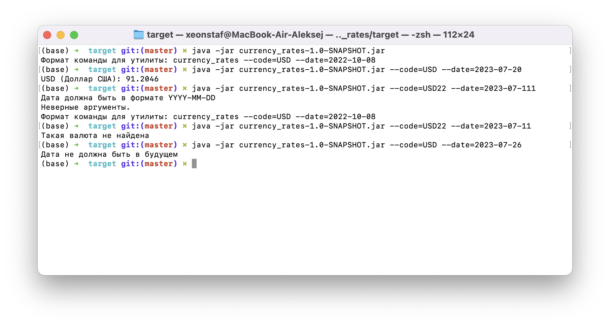

# Курс валют Центрального банка Российской Федерации

### Использование
```
java -jar currency_rates.jar --code=USD --date=2022-10-08
```

Где:
- `--code`: Код валюты, для которой нужно получить курс, в формате ISO (например, USD, EUR, AUD, и т.д.).
- `--date`: Дата, за которую нужно получить курс в формате YYYY-MM-DD (например, 2022-10-08).

### Примеры работы



